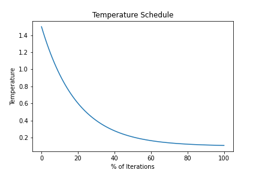
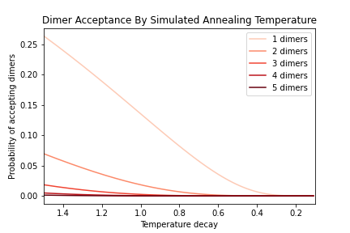
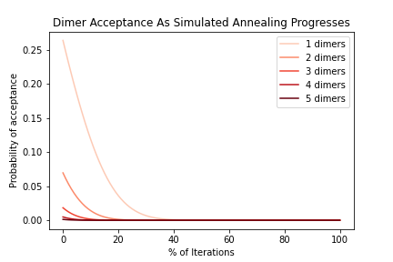

# Explore Optimization Parameters
The optimization process relies on a simulated annealing algorithm which allows earlier iterations to accept increases in dimer load to overcome local optima. The probability of accepting increased dimer load is defined by a variety of parameters, which can be explored with this function. 

[See here for optimization process details](7_OptimizationProcess.md) included simulated annealing algorithm parameterization. 


## Usage
The plot_ASA_temps.py function is setup to accept two different sets of inputs: 1) Provided simulated annealing parameters, or 2) Provided datasets used to calculate simulated annealing parameters (the default used in optimize_multiplex.py). Inputs are shown for both options. Provided datasets are ignored if MAX_DIMER and MIN_DIMER are provided.

### Python syntax
```
import multiplex_wormhole as mw
# provided parameters (with defaults shown):
mw.plotASAtemps(OUTPATH, MIN_DIMER, MAX_DIMER, DECAY_RATE=0.95, T_INIT=None, T_FINAL=0.1, DIMER_ADJ=0.1, PROB_ADJ=2):

# provided datasets using default parameters:
mw.plotASAtemps(OUTPATH, PRIMER_FASTA, DIMER_SUMS, DIMER_TABLE, N_LOCI, KEEPLIST=None, SEED=None, BURNIN=100, deltaG=False)

# providing a dataset with user-defined paramers:
mw.plotASAtemps(OUTPATH, PRIMER_FASTA, DIMER_SUMS, DIMER_TABLE, N_LOCI, KEEPLIST=None, SEED=None, BURNIN=100,
   deltaG=False, DECAY_RATE=0.95, T_INIT=None, T_FINAL=0.1,PROB_ADJ=2)

# providing a previous set of primers (e.g., from previous optimization) rather than new data, with all other defaults:
mw.plotASAtemps(OUTPATH, PRIMER_FASTA, SEED, DIMER_SUMS, DIMER_TABLE, N_LOCI, KEEPLIST=None)
```

### Command line syntax
```
cd ~/multiplex_wormhole/src/multiplex_wormhole #move into directory holding scripts

# provided parameters:
python3 plot_ASA_temps.py -o OUTPATH [-m MIN_DIMERS] [-a MAX_DIMERS] [-r DECAY_RATE] [-i TEMP_INIT]  [-f TEMP_FINAL] [-p PROB_ADJ] [-g]

# providing datasets:
python3 plot_ASA_temps.py -o OUTPATH [-f PRIMER_FASTA] [-d DIMER_SUMS] [-t DIMER_TABLE] [-n NLOCI] [-k KEEPLIST] [-b BURNIN] [-z SEED] [-g] 
```

### Arguments
**OUTPATH (-o)** : Prefix for output files, including directory path. 

**PRIMER_FASTA (-f)** : FASTA filepath containing primer sequences to test. *Important: PrimerIDs in this file must match primer pair IDs in DIMER_SUMS and DIMER_TABLE!* (Default: None)

**DIMER_SUMS (-d)** : Filepath to CSV containing dimer loads per primer pair. (Default: None)

**DIMER_TABLE (-t)** : Filepath to CSV containing pairwise primer dimer loads. (Default: None)

**N_LOCI (-n)** : Target panel size (includes keeplist loci), i.e. the number of unique targets and primer pairs in the optimized multiplex. (Default: None)

**KEEPLIST (-k)** : Filepath to FASTA file containing primer sequences that are required to be included in final primer set. (Default: None)

**SEED (-e)** : CSV to primer set used as initial loci, in format of multiplex_wormhole output *_primers.csv. This option overrides N_LOCI, so the number of loci in the SEED set will be the final number of loci in the primer set. (Default: None)

**MIN_DIMER (-m)** : Minimum 'bad' dimer change expected going from one iteration to the next. Generally MIN_DIMER=1. (Default: None - calculated from data)


**MAX_DIMER (-a)** : Maximum 'bad' dimer change expected moving from one iteration to the next. (Default: None - calculate from data)

**DECAY_RATE (-r)** : Base value used in decay function for temperature. Values close to 1 lead to slow temperature decay while decreasing values lead to more rapid temperature decay. (Default: 0.95, limit: 0-1)

**T_INIT (-i)** : Initial temperature where simulated annealing starts. If not provided, this value will be calculated from changes in dimer load. (Default: None- set adaptively)
Adaptively calculated as `MIN_DIMER + DIMER_ADJ * (MAX_DIMER - MIN_DIMER)`

**T_FINAL (-j)** : Final temperature where simulated annealing ends. If not provided, this value will be calculated from changes in dimer load. (Default: 0.1)

**BURNIN (-b)** : Number of 'bad' swaps used to sample changes in dimer loads. (Default: 100)

**PROB_ADJ (-p)** : Multiplier to adjust dimer acceptance probability, where 1=no adjustment and higher values reduce dimer acceptance probability. (Default: 2) 
The probability of accepting an increase in dimer load follows `e^(-PROB_ADJ*cost / temperature)`

**deltaG (-g)** : Optimize for total dimer tally (False) or maximum average deltaG among dimers (True)? [Default: False]


## Outputs

Probabilities reflect default parameters, although the initial (higher) temperature will vary depending on the dataset.

`OUTPATH`_TemperatureSchedule.png



`OUTPATH`_DimerAcceptanceByTemp.png



`OUTPATH`_DimerAcceptanceByIteration.png




[Previous](3_TabulateDimers.md)		[Next](4_OptimizeMultiplexPrimerSet.md)
