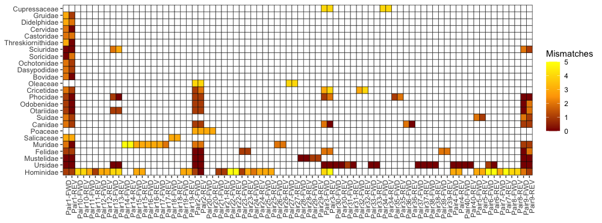
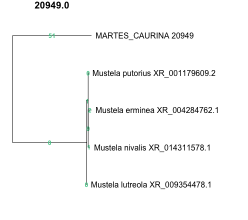

# Specificity Checking with PrimerTree
Ensuring primer specificity is an important and oft-neglected step towards successful and accurate genotyping of low-quality samples. This is particularly important when genotyping predator scats which can contain DNA from closely related species. Multiplex wormhole does not include a specificity check within the Python package, however, I'm providing an R script for post-processing multiplex wormhole outputs that cross-walks with the PrimerTree R package, which provides automated calling of PRIMER-BLAST.

## Recommendations
* Run specificity checks against:
  1. The target (i.e., by checking against the target species or a close relative) to ensure that only one target in the genome is amplified. This is particularly important in noninvasive samples because sequence variation due to paralogs (i.e., regions present multiple times across the genome) is not differentiable from sequence dropout (e.g., due to variable degradation among loci), which is the most common form of genotyping error. Paralogs in highly variable regions (e.g., mRNA transcript variants) can be particularly problematic because dropout can be caused by variation in the primer binding region, causing biased amplification failure. 
  2. Diet items to ensure that primers don't amplify non-target DNA within scats, especially in predators who tend to consume prey within their same class. More closely related diet items are more likely to amplify.
  3. Potential overmarkers or common visitors to the same device setup (e.g., cooccurring carnivores may visit the same hair snare). 
  4. Check against Bacteria if analyzing scats, since bacterial DNA will be abundant in scat samples.
  5. Check against human and other common lab contaminants.
* GenBank is a growing resource, and not all off-target species have good representation. I recommend using less stringent searches (e.g., family-level) rather than species-level searches.
* Off-target amplification can be ok (though never ideal), as long as the sequence is differentiable from the target amplicon (i.e. 2+ bp differences). Any off-target amplification within a 2-bp distance should be discarded because the resulting sequence variation in amplicons could be mistaken for SNPs.


## Description & Steps
[PrimerTree_specificity_checks.R](https://github.com/mhallerud/multiplex_wormhole/main/blob/src/multiplex_wormhole/primerTree_specificity_checks.R) provides a cross-walk between multiplex wormhole outputs and the [PrimerTree R package](https://github.com/MVesuviusC/primerTree) (Cannon et al. 2016). PrimerTree enables automated calls to [NCBI's PRIMER-BLAST](https://www.ncbi.nlm.nih.gov/tools/primer-blast/), which runs BLAST local alignments of primer pairs against specified taxonomic groups. PRIMER-BLAST uses modified BLAST settings to return results associated with lower matches that may still be amplified within PCR, and additionally applies a global Needleman-Wunsch alignment to ensure specificity, filters returned sequences dynamically based on the position of mismatches within the primer-binding regions, and filters sequnces for amplicon size (Ye et al. 2012). 


The steps and functions provided by mw are:
1. R - [runPrimerTree](#1_runPrimerTree): Identify off-target amplification for each primer pair
2. Python/CLI - [mw-specificity](#2_calculate_offtarget_thermodynamics): Calculates deltaG and Tm between each primer and off-target primer-binding site (Optional but highly recommended). 
3. R - [extractPrimerInfo](#3_extractPrimerInfo): Extracts primer binding locations and target amplicons from multiplex wormhole inputs and outputs (Optional but required for plotting amplicons)
4. R - [plotMismatches](#4_plotMismatches): Visualizes cumulative worst off-target interactions in a single figure by plotting the minimum number of mismatches per primer-taxa combination. 
5. R - [plotAmpliconTrees](#5_plotAmpliconTrees): Plots a phylogeny of off-target amplicons, filtered by deltaG if step 2 was run and including the target amplicon if step 3 was run, for visualizing genetic distance between off-target amplicons.

## R Package Dependencies
For primerTree specificity checks:
- PrimerTree (Cannon et al. 2016)
- plyr (Wickham 2011)
- dplyr (Wickham et al. 2023)
For phylogenetic reconstruction of alignments:
- DECIPHER (Wright 2016)
- Biostrings (Pagès et al. 2024)
For parallel processing:
- parallel
- doParallel
- foreach

      Note: runPrimerTree also requires internet connection to access NCBI.

## Loading R functions
Within R (replace "~" with location of your primerTree_specificity_checks.R script- [DOWNLOAD HERE](https://github.com/mhallerud/multiplex_wormhole/edit/main/docs/8_SpecificityChecks.md#:~:text=primerTree_specificity_checks.R):
```
source("~primerTree_specificity_checks.R")
```

## 1. runPrimerTree
This function loops through each primer pair and organism combination and runs PRIMER-BLAST using primerTree::primer_search, merging results into a single dataframe. Taxonomy and sequences are then pulled from NCBI for each record using the primerTree::get_taxonomy and primerTree::get_sequence commands. The output is a dataframe containing the query primer pair (FWD & REV) and full PRIMER-BLAST outputs. [Details on full functionality of primerTree](https://cran.r-project.org/web/packages/primerTree/refman/primerTree.html).

Note: This function is limited to 3 calls/second by NCBI. You can substantially increase speeds to 10 calls/second by requesting an API key from NCBI at [https://www.ncbi.nlm.nih.gov/account](https://www.ncbi.nlm.nih.gov/account).

### Usage in R
```
#options(ENTREZ_KEY="your_ncbi_api_key")
runPrimerTree(primers, organisms=c(), outcsv,
              fwd_adapter="tcgtcggcagcgtcagatgtgtataagagacag",
              rev_adapter="gtctcgtgggctcggagatgtgtataagagacag",
              all_combos=FALSE,
              THREADS=1,
              MAX_TARGET_SIZE=600,
              EXCLUDE_ENV="$0",
              PRIMER_SPECIFICITY_DATABASE="nt",
              ...)
# check output
primerblast <- read.csv(outcsv)
View(primerblast)
```
### Arguments
* **primers** : CSV output by multiplex wormhole optimization step, e.g., {OUTDIR}/3_OptimizedMultiplexes/Final_Primers/{OUTNAME}_Run01_primers.csv
* **organisms** : Vector or list of organisms to search using GenBank taxid names. For example, to check specificity of marten primers within martens, co-occurring carnivores, diet items, and possible scat/lab contaminants, this list could include: c("Mustelidae", "Carnivora", "Rodents and rabbits", "Aves", "Plethodontidae", "Ericaceae", "Bacteria", "Homo sapiens"). Broader groups are preferred to specific diet items because many species are unlikely to have full genomes represented within GenBank. These names can be explored using the "Add Organism" button on the [PRIMER-BLAST website](https://www.ncbi.nlm.nih.gov/tools/primer-blast/index.cgi). Note: increasing the number of organisms drastically increases runtimes! Use more general taxonomic names (e.g., "Plants") and then post-filter the table if needed. 
* **outcsv** : CSV where outputs will be saved.
* **fwd_adapter** : FWD overhang sequence that will be removed from FWD primers (FWD primer names must end with .FWD). Default is Illumina.
* **rev_adapter** : REV overhang sequence that will be removed from REV primers (REV primer names must end with .REV). Default is Illumina.
* **all_combos** : PRIMER-BLAST all FWD/REV combinations (NOTE: This will take a long time!).
* **THREADS** : Number of processors for multi-threading primer_search step (NOTE: This is multi-threading on a single machine, not multiprocessing across nodes/cores!)
* **MAX_TARGET_SIZE** : Maximum off-target amplicon size to return [Default: 600 bp]
* **EXCLUDE_ENV** : Exclude environmental samples? Yes="$0", No="". [Default: "$0"]
* **PRIMER_SPECIFICITY_DATABASE** : NCBI database to search, options:
  * "PRIMERDB/genome_selected_species" [Default]: Genomes for selected organisms (primary assembly only)
  * "nt" : NCBI nt database
  * "core_nt" : nt database without genomes
  * "refseq_mrna" : Refseq mRNA database
  * "refseq_representative_genomes" : RefSeq representative genomes database
  * "refseq_rna" : RefSeq RNA database
  * "Custom" + "CUSTOMSEQFILE"="<filepath>" : Custom BLAST database.
* **...** : Additional PRIMER-BLAST arguments will be passed to primerTree::primer_search. These can be explored by visiting the [PRIMER-BLAST website](https://www.ncbi.nlm.nih.gov/tools/primer-blast/index.cgi) and, at settings of interest, right-clicking and selecting "inspect element". Options and their defaults can be retrieved in R by loading the XML and httr packages, all functions from the [primerTree::primer_search source code](https://github.com/MVesuviusC/primerTree/blob/master/R/search.R), and then running lines 130-135 in that same file.

## 2. Off-target Thermodynamics
This function uses primer3-py to calculate thermodynamic stability of full binding sites and end stability of binding sites. Binding sites are identified from PrimerTree/PRIMER-BLAST outputs.
### Usage in Python
```
mw-specificity -i INFILE -o OUTFILE [-t ANNEAL_TEMP] [-m MV_CONC]
                      [-d DV_CONC] [-p DNTP_CONC] [-c DNA_CONC]
```

```
mw.offtargetThermodynamics(INFILE, OUTFILE, ANNEAL_TEMP=52.0, MV_CONC=50, DV_CONC=3.8, DNTP_CONC=0.25, DNA_CONC=50)
```
### Arguments
- **INFILE (-i)** : CSV containing PRIMER-BLAST outputs. Must contain 'forward_start', 'forward_stop', 'reverse_start', 'reverse_stop', 'Sequence', 'FWDseq', and 'REVseq' fields.
- **OUTFILE (-o)** : Filepath where CSV results will save.
- **ANNEAL_TEMP (-t)** : PCR annealing temp (Celsius). Default: 52
- **MV_CONC (-m)** : Monovalent salt concentration in PCR. Default: 50
- **DV_CONC (-d)** : Divalent salt concentration in PCR. Default: 3.8
- **DNTP_CONC (-p)** : Primer concentration in PCR. Default: 0.25
- **DNA_CONC (-c)** : DNA concentration in PCR. Default: 50


## 3. extractPrimerInfo
This function extracts the amplicon sequence and primer information for an optimized multiplex based on the input, intermediate, and output files from multiplex wormhole. 
### Usage in R
```
primerinfo <- extractPrimerInfo(templates, filtprimers, finalprimers, 
                                fwd_adapter="tcgtcggcagcgtcagatgtgtataagagacag", rev_adapter="gtctcgtgggctcggagatgtgtataagagacag")
View(primerinfo)
```
### Arguments
- **templates** : Input CSV containing template DNA sequences and targets input to multiplex wormhole (e.g, 0_Inputs/*Templates.csv). Can also be NA if this information is missing.
- **filtprimers** : CSV output by the [primer3BatchDesign](1_BatchPrimerDesign) of multiplex wormhole (e.g., 1_PrimerDesign/FilteredPrimers.csv). 
- **finalprimers** : CSV of primers in optimized multiplex (e.g., 3_Optimized_Multiplexes/Final_Primers/{OUTNAME)_Run01_primers.csv)
- **fwd_adapter** & **rev_adapter** : FWD & REV primer adapter sequences (5'-->3'), default is Illumina Nextera i5 & i7. 
### Output
The output is a dataframe containing the primer information, template sequences and targets, and amplicon sequences and targets (i.e., the shifted target position relative to the full template).


## 4. plotMismatches
For each group in the specified grouping field, finds and plots the minimum primer mismatches found across off-target amplicons. This allows for a quick one-figure evaluation of the extent of off-target amplification, with the caveat that this approach will likely overestimate off-target amplification when broad groups are used because primers are considered independently (i.e., the sequence/taxa with minimum mismatches for FWD may be different from that of REV). Requires ggplot2.
### Usage in R
```
primerblast <- read.csv("primertree_output.csv")
plotMismatches(primerblast, group="genus", title="your title")
#may also be added to as a ggplot, e.g.:
plotMismatches(primerblast, group="genus")+coord_flip()+ggtitle("your title")
```
### Arguments
- **primerblast** : Output from runPrimerTree, loaded into R as a dataframe.
- **group** : Field used to group outputs. 
- **title** : Plot title [default: element_blank]
### Output
Example showing primer mismatches for predicted amplification of a panel.




## 5. plotAmpliconTrees
This function uses the DECIPHER package's [maximum-likelihood trees with ancestral state reconstruction](https://decipher.codes/AncestralStates.html) to visualize the number of mismatches between the target amplicon and sequences produced by *in silico* off-target amplification. For each primer pair, the target amplicon is aligned to off-target sequences with DECIPHER::DECIPHER::AlignSeqs, then a maximum likelihood dendrogram is constructed with DECIPHER::TreeLine(method="ML", reconstruct=True). `TreeLine` infers ancestral sequences for each node in the tree, then the number of mismatches can be calculated at each split. These state transitions are plotted at each node of the dendrogram and represent the number of mismatches between sequences or clusters. A sequence tree plot is made for each primer pair. Off-target sequences can be optionally filtered by delta G values from mw.offtargetThermodynamics results. To be conservative, the default is to plot all off-target sequences with deltaG<0 of the full binding site.
### Usage in R
```
primerblast <- read.csv("primerblast_thermodynamics.csv")

# save to a PDF since this will be a bunch of plots
pdf("PRIMERBLAST_Trees.pdf") #open PDF
par(mar=c(1,1,1,16)) # adjust plotting margins
plotAmpliconTrees(primerblast, primerinfo=NA, species="TARGET", dG=0, dG_end=NA, MAX_AMPLICON_SIZE=500, THREADS=1, ...)
dev.off() #close PDF
```
### Arguments
- **primerblast** : Table output by runPrimerTree. May use other BLAST-like specificity check results as long as the table contains "FWD", "REV", "Sequence", "accession", and "species" fields, with sequences trimmed at the primer binding sites. 
- **primerinfo** : Table output by extractPrimerInfo (required to plot target amplicon). May use other inputs as longs as they contain "LocusID" and "AmpliconSeq" fields. [Default: NA].
- **species** : Prefix for target amplicon sequences in plot. Recommended to fully capitalize to facilitate identification of target sequences within plots. [Default: NA]
- **dG** : Upper DeltaG threshold to include primer-binding sites. Both the FWD and REV primer-binding site must meet this threshold for the sequence to be plotted. Use NA if thermodynamics haven't been calculated. [Default: 0]
- **dG_end** : Upper DeltaG threshold for 3' ends to include primer-binding sites. Both the FWD and REV primer-binding sites must meet this threshold for the sequence to be plotted. [Default: NA]
- **MAX_AMPLICON_SIZE** : Max off-target amplicon size to include in plots. Requires "product_length" field output by offtarget_thermodynamics above, otherwise set to NA to skip. [Default: 500]
- **THREADS** : Number of processors (for multi-threading). [NOTE: This is multi-threading on a single machine, not multiprocessing across nodes/cores! Will likely fail on a supercomputing cluster]
- **...** : additional arguments that are passed to "plot.dendrogram" for all plots.


_Note: If you are having problems with the PDF output, you can just run the raw plotAmpliconTrees command- it will just make a ton of plots._

### Output
This example shows predicted off-target amplification of *Mustela*, with a 51-bp difference in the *Mustela* sequence compared to the target *Martes caurina* amplicon. See the [DECIPHER vignette](https://decipher.codes/Documentation-GrowingTrees.html) for more details on interpreting ancestral reconstruction output.




## Citations
Cannon, M, j Hester, A Shalkhauser, ER Chan, K Logue, ST Small, D Serra. 2016. In silico assessment of primers for eDNA studies using PrimerTree and application to characterize the biodiversity surrounding the Cuyahoga River. Scientific Reports 6: 22908. [doi:10.1038/srep22908](https://doi.org/10.1038/srep22908)

Pagès, H, P Aboyoun, R Gentleman, S DebRoy 2024. Biostrings: Efficient manipulation of biological strings. R package version 2.72.1, [https://bioconductor.org/packages/Biostrings](https://bioconductor.org/packages/Biostrings)

Wickham, H. 2011. The Split-Apply-Combine Strategy for Data Analysis. Journal of Statistical Software, 40(1), 1-29. [https://www.jstatsoft.org/v40/i01/](https://www.jstatsoft.org/v40/i01/)

Wickham, H, R François, L Henry, K Müller, D Vaughan. 2023. dplyr: A Grammar of Data Manipulation. R package version 1.1.4. [https://CRAN.R-project.org/package=dplyr](https://CRAN.R-project.org/package=dplyr)

Wright, ES. 2016. Using DECIPHER v2.0 to Analyze Big Biological Sequence Data in R. The R Journal: 8(1): 352-359. [doi: 10.32614/RJ-2016-025](https://doi.org/10.32614/RJ-2016-025)

Ye, J., Coulouris, G., Zaretskaya, I. et al. 2012. Primer-BLAST: A tool to design target-specific primers for polymerase chain reaction. BMC Bioinformatics 13, 134. [https://doi.org/10.1186/1471-2105-13-134](https://doi.org/10.1186/1471-2105-13-134)

### PRIMER-BLAST OPTIONS
This is a list of PRIMER-BLAST options that can be input as arguments into primerTree::primer_search. Defaults shown. To determine which option corresponds to which [PRIMER-BLAST webpage](https://www.ncbi.nlm.nih.gov/tools/primer-blast/index.cgi) setting, you can right-click on the setting on the website and select "Inspect element", then look for the corresponding "name" and "value".

* SEQFILE=NA,
* PRIMER5_START=NA,
* PRIMER5_END=NA,
* PRIMER3_START=NA,
* PRIMER3_END=NA,
* PRIMER_LEFT_INPUT=NA,
* PRIMER_RIGHT_INPUT=NA,
* PRIMER_PRODUCT_MIN=70,
* PRIMER_PRODUCT_MAX=1000,
* PRIMER_NUM_RETURN=10,
* PRIMER_MIN_TM=57.0,
* PRIMER_OPT_TM=60.0,
* PRIMER_MAX_TM=63.0,
* PRIMER_MAX_DIFF_TM=3,
* PREFER_3END=,
* PRIMER_ON_SPLICE_SITE=0,
* SPLICE_SITE_OVERLAP_5END=7,
* SPLICE_SITE_OVERLAP_3END=4,
* SPLICE_SITE_OVERLAP_3END_MAX=8,
* SPAN_INTRON=,
* MIN_INTRON_SIZE=1000,
* MAX_INTRON_SIZE=1000000,
* SEARCH_SPECIFIC_PRIMER="on",
* SEARCHMODE=0,
* PRIMER_SPECIFICITY_DATABASE="nt",
* CUSTOMSEQFILE=NA,
* EXCLUDE_XM=NA,
* EXCLUDE_ENV=NA,
* ORGANISM="Homo sapiens",
* ORGANISM2="rodents and rabbits 314147",
* slctOrg=,
* ENTREZ_QUERY=NA,
* TOTAL_PRIMER_SPECIFICITY_MISMATCH=1,
* PRIMER_3END_SPECIFICITY_MISMATCH=1,
* MISMATCH_REGION_LENGTH=5,
* TOTAL_MISMATCH_IGNORE=6,
* MAX_TARGET_SIZE=1000,
* ALLOW_TRANSCRIPT_VARIANTS=NA,
* NEWWIN=NA,
* SHOW_SVIEWER=on,
* HITSIZE=50000,
* EVALUE=30000,
* WORD_SIZE=7,
* MAX_CANDIDATE_PRIMER=500,
* NUM_TARGETS=20,
* NUM_TARGETS_WITH_PRIMERS=1000,
* MAX_TARGET_PER_TEMPLATE=100
* PRODUCT_MIN_TM=,
* PRODUCT_OPT_TM=,
* PRODUCT_MAX_TM=,
* PRIMER_MIN_SIZE=15,
* PRIMER_OPT_SIZE=20,
* PRIMER_MAX_SIZE=25,
* PRIMER_MIN_GC=20.0,
* PRIMER_MAX_GC=80.0,
* GC_CLAMP=0,
* POLYX=5,
* PRIMER_MAX_END_STABILITY=9,
* PRIMER_MAX_END_GC=5,
* TH_OLOGO_ALIGNMENT=,
* TH_TEMPLATE_ALIGNMENT=,
* PRIMER_MAX_TEMPLATE_MISPRIMING_TH=40.00,
* PRIMER_PAIR_MAX_TEMPLATE_MISPRIMING_TH=70.00,
* PRIMER_MAX_SELF_ANY_TH=45.0,
* PRIMER_MAX_SELF_END_TH=35.0,
* PRIMER_PAIR_MAX_COMPL_ANY_TH=45.0,
* PRIMER_PAIR_MAX_COMPL_END_TH=35.0,
* PRIMER_MAX_HAIRPIN_TH=24.0,
* PRIMER_MAX_TEMPLATE_MISPRIMING=12.00,
* PRIMER_PAIR_MAX_TEMPLATE_MISPRIMING=24.00,
* SELF_ANY=8.00,
* SELF_END=3.00,
* PRIMER_PAIR_MAX_COMPL_ANY=8.00,
* PRIMER_PAIR_MAX_COMPL_END=3.00,
* EXCLUDED_REGIONS=NA,
* OVERLAP=NA,
* OVERLAP_5END=7,
* OVERLAP_3END=4,
* MONO_CATIONS=50.0,
* DIVA_CATIONS=1.5,
* CON_DNTPS=0.6,
* SALT_FORMULAR=1,
* TM_METHOD=1,
* CON_ANEAL_OLIGO=50.0,
* NO_SNP=,
* PRIMER_MISPRIMING_LIBRARY=AUTO,
* LOW_COMPLEXITY_FILTER=on,
* PICK_HYB_PROBE=,
* PRIMER_INTERNAL_OLIGO_MIN_SIZE=18,
* PRIMER_INTERNAL_OLIGO_OPT_SIZE=20,
* PRIMER_INTERNAL_OLIGO_MAX_SIZE=27,
* PRIMER_INTERNAL_OLIGO_MIN_TM=57.0,
* PRIMER_INTERNAL_OLIGO_OPT_TM=60.0,
* PRIMER_INTERNAL_OLIGO_MAX_TM=63.0,
* PRIMER_INTERNAL_OLIGO_MIN_GC=20.0,
* PRIMER_INTERNAL_OLIGO_OPT_GC_PERCENT=50,
* PRIMER_INTERNAL_OLIGO_MAX_GC=80.0,
* NA=NA
NEWWIN=,
SHOW_SVIEWER=on
