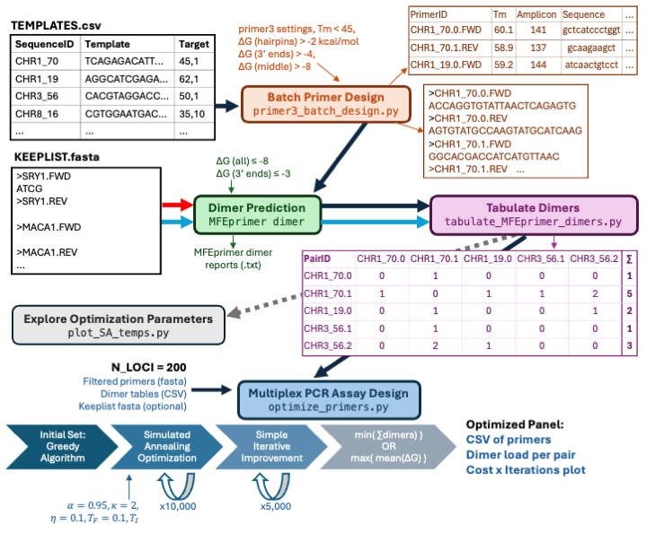
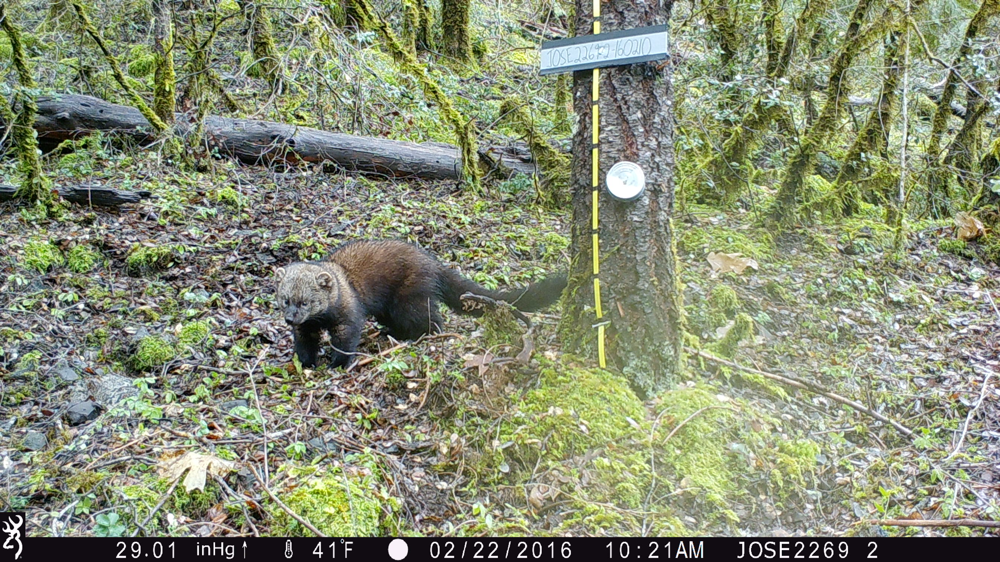

# multiplex wormhole
*In silico* multiplex PCR primer design for noninvasive wildlife genetics.


## Quick Start
Within terminal / command prompt:
(You may need to set up a virtual python environment first: )

```
# download multiplex wormhole
git clone https://github.com/mhallerud/multiplex_wormhole
# install python dependencies
pip install pandas==1.4.4
pip install numpy==1.24.4
pip install matplotlib==3.5.2
pip install primer3-py==2.0.0
# install MFEprimer
python3 multiplex_wormhole/src/scripts/setup_mfeprimer.py
```

Now you are ready to run multiplex wormhole!

Command line usage:
```
# panel design
# -d: deltaG optimization (details in Optimization section below
# -v: verbose
python3.9 multiplex_wormhole.py -t TEMPLATES -n NLOCI -o OUTDIR [-p PREFIX] [-k KEEPLIST] [-r RUNS] [-i ITER] [-s SIMPLE] [-d] [-v]

# panel assessment
panel_assessment.py [PRIMERFASTA | PRIMERCSV]
```

Python usage:
```
# setup
import sys
sys.path.append("YOURPATHTO/multiplex_wormhole")

# panel design
from multiplex_wormhole import main as multiplex_wormhole
multiplex_wormhole(TEMPLATES,
                   N_LOCI,
                   OUTDIR,
                   KEEPLIST,
                   N_RUNS,
                   ITERATIONS,
                   SIMPLE,
                   deltaG,
                   VERBOSE)

# panel assessment
from panel_assessment import main as assess_panel
assess_panel(PRIMERFASTA)
# or
assess_panel(PRIMERCSV)
```

**Using the multiplex_wormhole function will use defaults for all other parameters. Check out the workflow below and specific functions for higher flexibility in settings.**

## Input file format
Create a CSV file with a row for each candidate and columns named SEQUENCE_ID containing sequence names (limit punctuation marks to underscores), SEQUENCE_TEMPLATE containing the template DNA sequence in 5'-->3' direction, and SEQUENCE_TARGET containing the base pairs targeted for PCR amplification following primer3 format: *startBP*,*length*. For example, a SNP at the 100th base pair in the sequence would be denoted as 100,1 in the SEQUENCE_TARGET field. If there are 2 SNPs, for example at the 50th and 90th base pairs in the sequence, 50,40 would be the target. [Example input CSV](examples/Input_Templates.csv). 

Each DNA sequence in the FASTA file will be treated as a unique target for PCR amplification (i.e., sequences should be non-overlapping and unique).

The [create_in_templates](scripts/create_in_templates.R) R script can be used to create this file using VCF and FASTA as inputs. The R script handles two input types:

* *de novo*: Matches formatting output of *de novo* Stacks pipeline with FASTA created by `populations --fasta-loci`. Assumes the VCF 'CHROM' field matches the FASTA sequence headers with a set prefix such as "CLocus_".

* *reference-aligned: Assumes the FASTA sequence header is in the format `CHROM`:`startBP`-`endBP` where `CHROM` matches the reference sequence denoted as 'CHROM' field in the VCF, `startBP` is the position in the reference sequence where the FASTA sequence starts, and `endBP` is the position in the reference sequence where the FASTA sequence ends. This format can be extracted from reference-aligned SNP data in VCF format (e.g., output from Stacks, bcftools mpileup, etc.) using the following commands with REF.FASTA as the reference genome:

```
# NOTE: Flanking regions of 100-bp are used here as this is roughly the amplicon length targeted and provides good primer binding space on either side of the target SNP, but this can be adjusted if longer or shorter amplicons are desired. 
# thin to 1 SNP per 100-bp to avoid overlapping template sequences
# this step is not necessary if linkage disequilibrium pruning has already been performed on the input VCF
vcftools --vcf <IN.VCF> --thin 100 --out Thinned100bp --recode

# convert SNPs into bed format 
bcftools query -f '%CHROM\t%POS\n' Thinned100bp.recode.vcf | awk '{print $1"\t"$2-1"\t"$2}' | awk '{print $0"\t"$1":"$3}' > Thinned100bp.bed

# make tab-delimited file with reference sequence IDs in the first field and sequence lengths in the second field
seqkit fx2tab --length --name <REF.FASTA> chr_lengths.txt 

# grab 100-bp flanking regions around thinned SNPs
bedtools slop -b 100 -i Thinned100bp.bed -g chr_lengths.txt > Thinned100bp_Flanking100bp.bed

# make fasta of these
bedtools getfasta -fi <REF.FASTA> -bed Thinned100bp_Flanking100bp.bed -fo <OUT.FA>
```

# Inputs and Outputs
## Input Preparation
The only required input to multiplex wormhole is a table with DNA sequences including target and flanking regions (see step 1 under quick-start guide below for details). Optionally, users can also add a "keeplist" FASTA file of primers which must be included in the final multiplex, for example primers from a pre-existing panel that is being added onto. *Note that multiplex wormhole designs primers based on standardized primer3 PCR conditions including a melting temperature between 58-62 degrees. If keeplist primers were designed using different PCR conditions and primer design settings, these should be adjusted in the files found in the primer3_settings directory.*

I use the following steps to prepare input data:
1. *SNP discovery* using data from reduced representation sequencing (e.g., RADseq) or whole genome sequencing (WGS) projects
2. *Initial SNP filtering* following standard genomics guidelines to remove erroneous SNPs (e.g., removing SNPs with low quality scores, low depths or extremely high depths, and high missingness; O'Leary et al. 2018). 
3. *Target SNP filtering* where SNPs with high information content based on the objective(s) of the panel are selected. For example, SNPs with high minor allele frequencies are selected for individual identification, while SNPs with high Fst or delta values are selected for population assignment. Multiplex wormhole treats all candidates equally, it is therefore the responsibility of the user to select informative candidate DNA sequences based on their objectives. 
4. *Extract flanking regions around SNPs* using --fasta-loci for RADseq data and bedtools getfasta for WGS data. For reference-aligned data, masking repetitive regions is recommended prior to this step.
5. *Remove candidates in known repetitive regions* by checking alignments to known repetitive elements using (CENSOR](https://www.girinst.org/censor/index.php)

## Outputs
Multiplex wormhole is an **in silico** design tool and additional testing of primers is needed. For example, here is my process for further checking and optimizing multiplex wormhole output:
1. *Specificity check against prey species* using [PRIMER-BLAST](https://www.ncbi.nlm.nih.gov/tools/primer-blast/)- this is especially important when genotyping scat samples
2. *Initial lab testing in equimolar multiplex* to assess amplification success in target samples, test specificity against prey and closely related co-occurring species, and estimate genotyping error rates based on PCR replicates and/or comparison of high-quality and low-quality samples from the same known individuals


## Multiplex Primer Design Workflow
Download this script to run multiplex wormhole function-by-function for ultimate flexibility: [multiplex_primer_design.py](https://github.com/mhallerud/multiplex_wormhole/blob/main/multiplex_primer_design.py). Click on the major functions below for detailed information on inputs, outputs, and settings (including defaults). 

1. [Batch Primer Design](https://mhallerud.github.io/multiplexwormhole/primer-design) with `primer3_batch_design.py`
   
2. [Dimer Prediction](https://mhallerud.github.io/multiplexwormhole/dimer-prediction) with `MFEprimer dimer`
  
3. [Tabulate Dimers](https://mhallerud.github.io/multiplexwormhole/tabulate-dimers) with `tabulate_dimers.py`

   (Optional): [Explore Optimization Parameters](https://mhallerud.github.io/multiplexwormhole/plot-asa-params) with `plot_ASA_temps.py`
  
4. [Optimize Multiplex Primers](https://mhallerud.github.io/multiplexwormhole/optimize-multiplex-pcr) with `optimize_multiplex.py`

5. [Multiple Run Optimization](/multiple-run-optimization) with `multiple_run_optimization.py`



## Panel Assessment Workflow
The panel assessment workflow applies the [Dimer Prediction](https://mhallerud.github.io/multiplexwormhole/dimer-prediction) and [Tabulate Dimers](https://mhallerud.github.io/multiplexwormhole/tabulate-dimers) functions to assess existing primer assays. See [Panel Assessment](https://mhallerud.github.io/multiplexwormhole/assess-panel) for details on inputs, outputs, and settings (including defaults) for this workflow. 

## Optimization Details
The multiplex wormhole `optimize_primers.py` function uses a combination of simple iterative improvement and simulated annealing algorithms to minimize dimer load in the multiplex primer set, where dimer load can be measured by a) tallying pairwise dimers or b) maximizing mean Gibbs free energy (deltaG; a meeasure of dimer strength) of pairwise dimers. See [Optimization Algorithm](https://mhallerud.github.io/multiplexwormhole/optimization-process) for details.

### A Note on the Optimization Process
Optimization works best when there are >4 times as many candidates relative to the number of target loci. Problems with few candidates relative to targets (e.g., 50 inputs loci for a 40-locus target) are likely to underperform because relatively few combinations are possible. The number of candidate loci needed to build dimer-free primer sets increases substantially with the number of target loci because finding primers that do not interact becomes more difficult. For example, we have had success designing 50-plexes from 200 input sequences, but designing a 150-plex with minimal primer interactions required >2000 candidate sequences.

## Alternative dimer calculation tools
The pipeline is built to use MFEprimer dimer to calculate dimer formation, however the optimization process will accept any input tables as long as the 2 input tables specify 1) pairwise dimer loads between primer pairs and 2) the total dimer load per primer pair, with primer pair IDs matching between the input templates and both tables. See example inputs in the [examples folder](https://github.com/mhallerud/multiplex_wormhole/examples).

One alternative to MFEprimer dimer is Primer Suite's Primer Dimer tool, though we have found dimers to be overestimated using this tool. To use this tool to calculate dimers:
1. Copy the *_specificityCheck_passed.csv file into [primer-dimer.com](https://primer-dimer.com), select 'Multiplex Analysis' and 'Dimer Structure Report', and click Submit. Depending on how many loci you provided, this step may take awhile (~20 minutes for primers for 50 loci, multiple hours for 1200 loci).

2. Run scripts/translate_primerSuite_report.R on the PrimerDimerReport.txt file downloaded from primer-dimer.com to convert this to a CSV. The delta G threshold specified will filter out any primer dimers with delta G above this value.

Another alternative is [ThermoFisher's Multiplex Primer Design](https://www.thermofisher.com/us/en/home/brands/thermo-scientific/molecular-biology/molecular-biology-learning-center/molecular-biology-resource-library/thermo-scientific-web-tools/multiple-primer-analyzer.html), however multiplex_wormhole currently has no support for translating these outputs into tables.

## Problems? Ideas?
Problems, bugs, or thoughts for enhancement can be reported on the [GitHub Issues page](https://github.com/mhallerud/multiplex_wormhole/issues). You can also contact Maggie Hallerud (hallerum@oregonstate.edu).

## Success Stories
Multiplex wormhole has been used to develop noninvasive genotyping panels for:





Contact us if you want to add your species to the list!
